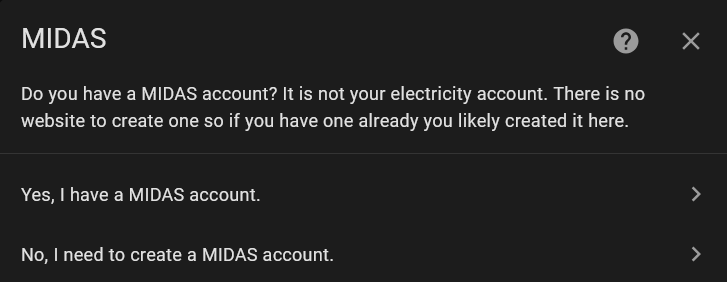
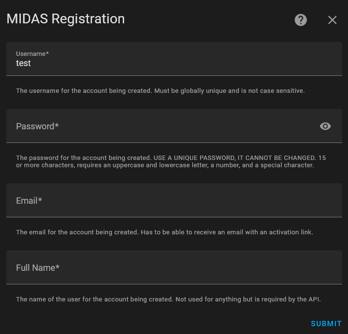
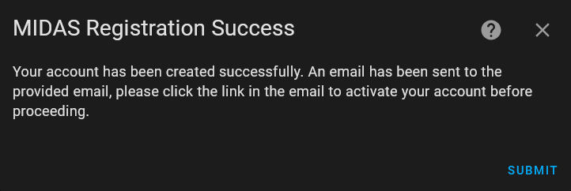
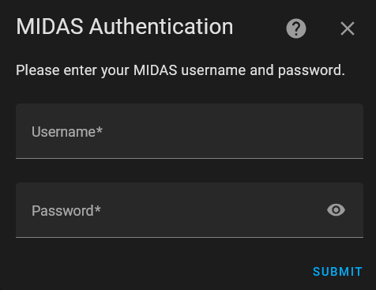
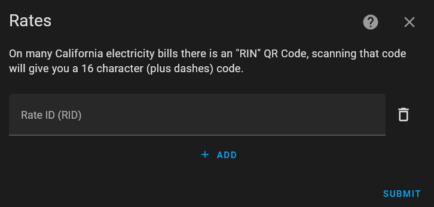
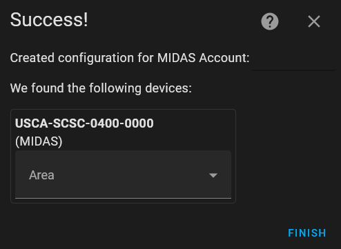
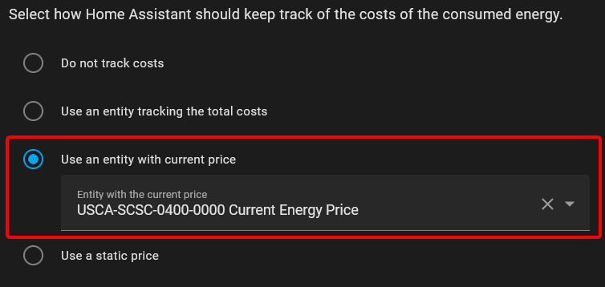

# MIDAS (California Energy Prices)

Custom integration to get the current electricity price and other data for many California electric bills from the California energy regulator's electricity price API MIDAS.

If your electric bill has a **RIN QR Code** on it, you can use this integration to get your current electricity price.

## Installation

To install this integration, add this GitHub Repo to the HACS Custom Repositories, or click the badge above.

## Configuration

Configuration is done in the UI, please follow the steps below for guidance.

1. Add the integration in the `Devices & services` section or click this add link:

2. Choose whether you have a MIDAS account or not.
  
3. If you don't have a MIDAS account the integration will help you create one.
  
  Once complete, click the link sent to your email to activate your account.
  
4. Enter your MIDAS account information.
  
5. Enter one or more Rate IDs to monitor, obtained from the QR code on your electric bill.
  
6. A device will be created for each Rate ID entered.
  

These entities can be used in the Energy dashboard to set prices, in automations to help conserve energy when prices will increase soon, and more!

## Contributions are welcome!

If you want to contribute to this please read the [Contribution guidelines](CONTRIBUTING.md)
