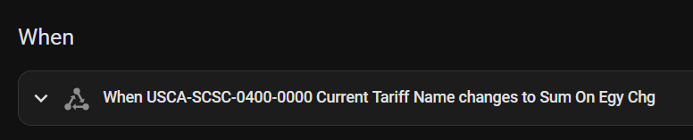

# MIDAS (California Energy Prices)

Custom integration to get the current electricity price and other data for many California electric bills from the California energy regulator's electricity price API MIDAS.

If your electric bill has a **RIN QR Code** on it, you can use this integration to get your current electricity price.

## Installation

To install this integration, add this GitHub Repo to the HACS Custom Repositories, or click the badge above.

## Configuration

Configuration is done in the UI, please follow the steps below for guidance.

1. Add the integration in the `Devices & services` section or click this add link:  

2. Choose whether you have a MIDAS account or not.  
  
3. If you don't have a MIDAS account the integration will help you create one.  
    
  Once complete, click the link sent to your email to activate your account.  
  
4. Enter your MIDAS account information.  
  
5. Enter one or more Rate IDs to monitor, obtained from the QR code on your electric bill.  
  
6. A device will be created for each Rate ID entered.  
  

These entities can be used in the Energy dashboard to set prices, in automations to help conserve energy when prices will increase soon, and more!  

## Setup recommendations
I recommend placing the MIDAS price entities inside a "Combine the state of several sensors" helper. This can help resolve the following issues and make your steup more resilient:
* If you're a Community Choice Aggregation (CCA) customer you have 2 RINs. Combine them with a Sum type to get a single entity that has your true per-kWh cost.
* If you ever change your electricity plan, like moving from one time-of-use plan to another or buying an electric vehicle or solar panels, placing your price sensors inside a helper will let you keep your energy dashboard history and replace the source sensor when your plan updates.
* Your electricity company can update your RIN at any time even if the amount you actually pay stays the same. If that happens, you'll need to update which RINs this integration provides which may cause the loss of the old rate's data.

## Contributions are welcome!

If you want to contribute to this please read the [Contribution guidelines](CONTRIBUTING.md)

<!-- ## About the logo
The logo for this integration was created specifically for it because the MIDAS API itself does not have a logo. The California Energy Commission (CEC), the organization that runs MIDAS, use their logo to refer to the MIDAS API and require specific permission to use their logo anywhere outside of their website.

The California outline is [Designed by Freepik](https://www.freepik.com/free-vector/flat-design-usa-states-outline-map_25000452.htm)
The lightning bolt is from [FontAwesome](https://fontawesome.com/icons/bolt-lightning)
The font is [Asap Condensed](https://fonts.google.com/specimen/Asap+Condensed) -->

